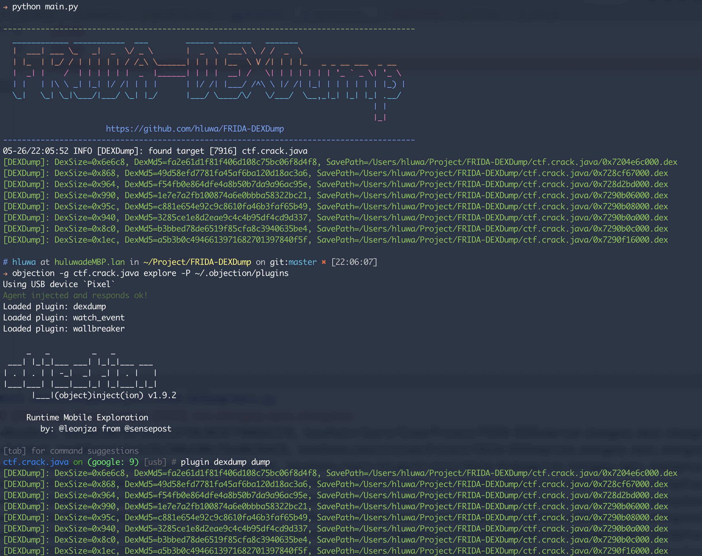

# FRIDA-DEXDump

`frida-dexdump` is a frida tool to find and dump dex in memory to support security engineers in analyzing malware.

## Make Jetbrains Great Again

<p align="center">
    
    
</p>

## Features

1. Support fuzzy search broken header dex(deep search mode).
2. Compatible with all android version(frida supported).
3. One click installation, without modifying the system, easy to deploy and use.

## Installation

```
pip3 install frida-dexdump
```

## Usage

CLI arguments base on [frida-tools](https://github.com/frida/frida-tools), you can quickly dump the foreground application like this:

```
frida-dexdump -FU
```

Or specify and spawn app like this:

```
frida-dexdump -U -f com.app.pkgname
```

Additionally, you can see in `-h` that the new options provided by frida-dexdump are: 

```
-o OUTPUT, --output OUTPUT  Output folder path, default is './<appname>/'.
-d, --deep-search           Enable deep search mode.
--sleep SLEEP               Waiting times for start, spawn mode default is 5s.
```

When using, I suggest using the `-d, --deep-search` option, which may take more time, but the results will be more complete.



## Build and develop

```
make
```

### Requires

See [requirements.txt](https://github.com/hluwa/FRIDA-DEXDump/blob/master/requirements.txt)

## Internals

[《深入 FRIDA-DEXDump 中的矛与盾》](https://mp.weixin.qq.com/s/n2XHGhshTmvt2FhxyFfoMA)